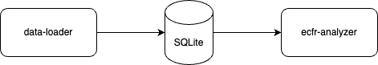

# eCFR Analyzer

This repository contains two parts:

- `data-loader`: a Python project that downloads and analyzes data from the eCFR API.
- `ecfr-analyzer`: a Next.js web application used to visualize and explore the data.

The `data-loader` stores the data in an SQLite database which the `ecfr-analyzer` reads from. I chose SQLite to simplify the deployment.

CFR information is analyzed by agency. The `data-loader` retrieves a list of agencies and then retrieves each title/subtitle/chapter of the CFR the agency owns to collect metrics. The two metrics it currently collects are:

- Word Count by section, aggregated up to the agency level.
- Compliance Burden, a custom metric that is calculated based on the word count and the complexity of the regulation. Complexity is estimated by analyzing the frequency of the following in the text:
  - requirements (shall|must|required|mandatory)
  - conditionals (if|unless|provided that|subject to)
  - exceptions (except|exception|excluding|other than|exemption|waiver)
  - deadlines (within|deadline|not later than|prior to)
  - paperwork (form|report|submit|file|document)
  - penalties (penalty|violation|fine|enforcement|prohibited)

## Getting it Running

1. Load data

        cd data-loader
        pip install -r requirements.txt
        ./loadData.sh

2. Run the web app in Docker

        cd ../ecfr-analyzer
        docker build -t ecfr-analyzer .
        docker run -p 8038:8038 ecfr-analyzer

3. Navigate to http://localhost:8038 in your web browser

## Notes

MVP: word count and complexity by agency

eCFR API docs: https://www.ecfr.gov/developers/documentation/api/v1#/

Useful endpoints:

- `api/versioner/v1/titles.json` - retrieves titles and `latest_issue_date`
- `api/admin/v1/agencies.json` - ties subtitles and chapters to agencies
- `api/versioner/v1/versions/title-{title}.json` - retrieves full title structure

There are bulk exports available on govinfo.gov. They are delayed and the XML schema doesn't match what comes out of the eCFR API.
